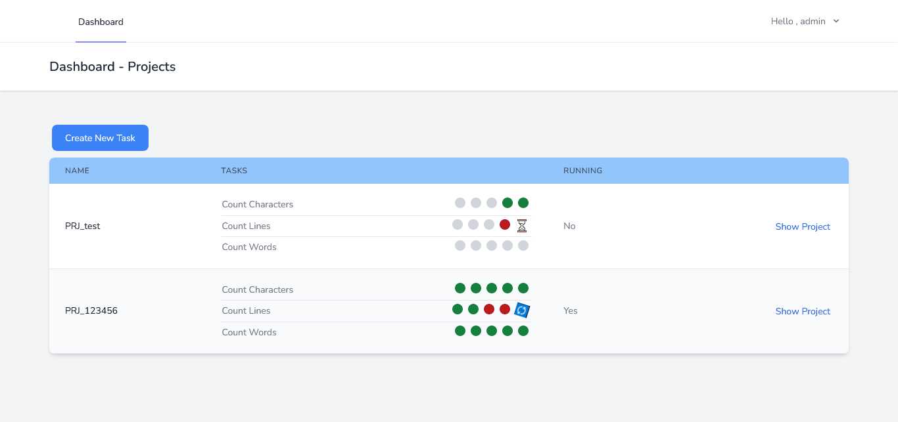
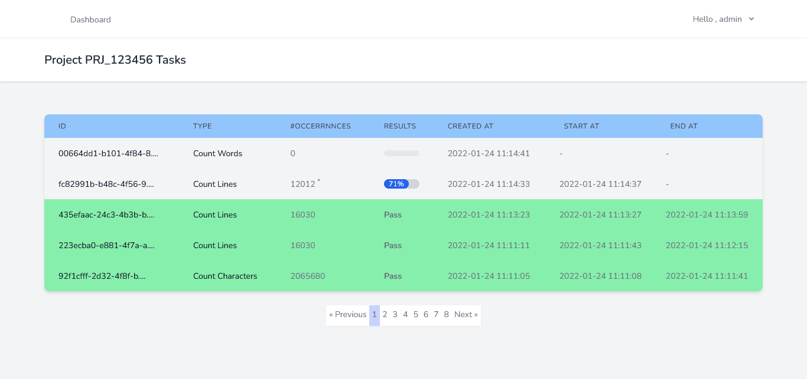

# Project task runner.

>The goal of the system is to create and run tasks with queue and job batches






## Installing / Getting started

### Used Technologies

```shell
PHP
LARAVEL
VUE.JS
Inertia.js
Tailwind CSS 
```

### Server Requirements

- `PHP >= 7.4`
- `MYSQL >= 5.7.36`
- `BCMath PHP Extension`
- `Ctype PHP Extension`
- `Fileinfo PHP extension`
- `JSON PHP Extension`
- `Mbstring PHP Extension`
- `OpenSSL PHP Extension`
- `PDO PHP Extension`
- `Tokenizer PHP Extension`
- `XML PHP Extension`

### Installation

Clone the repository

    git clone https://github.com/ahmedwassef/run-tasks-with-queue.git

Switch to the repo folder

    cd run-tasks-with-queue

Install all the dependencies using composer

    composer install

Copy the example env file and make the required configuration changes in the .env file

    cp .env.example .env

Generate a new application key

    php artisan key:generate

Run the database migrations (**Set the database connection in .env before migrating**)

    php artisan migrate

Run the database Sedders
    php artisan db:seed

Run the storage File Links

    php artisan storage:link

Start the local development server

    php artisan serve

Run queue

    php artisan queue:work


Use email : admin@admin.com
And password : 123456 to login 

### Project structure

- `app/Models` - Contains all the Eloquent models
- `app/Contacts` - Contains all Interfaces
- `app/Services` - Contains all Service that count the words , lines and characters 
- `app/Job/FileCounter` - The Job which run to calculate the count of running tasks. 
- `app/Http/Controllers/Admin` - Contains all the admin controllers
- `resources/js` - Contains all vue js components
- `resources/views/app.blade.php` - The main blade which contain all vue js rendered components
- `database/migrations` - Contains all the database migrations
- `database/seeds` - Contains the database seeder
- `routes` - Contains all the routes defined in web.php file


### Environment variables

you can sleep job per seconds to detect progress by change
the variable value with seconds.
the default value is 0

    JOB_SLEEP_SECONDS = 0 
